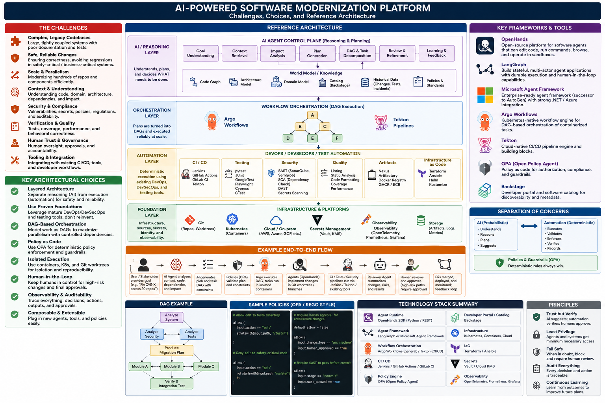

# Reference Architecture

[](../images/modernization-platform-reference-architecture.png)

*The platform on one page. Select the image to open it at full size.*

!!! note "Reading the infographic against this site's vocabulary"
    * The top band, labelled *AI agent control plane*, is what this site calls the **reasoning
      layer**. Here, *control plane* always means the deterministic layer that enforces policy,
      leases and budgets: see [Vocabulary](../index.md#vocabulary).
    * Its end-to-end flow ends at "PRs merged". On this site, merging always goes through the
      [merge queue](../integration/merge-queue.md), validated against the latest base.

[Foundations](../foundations/index.md) shows the *coordination* view: how work flows from
intent through isolated execution into a single controlled gate. This page shows the
complementary *platform* view: which layers the system is built from, which of them are new,
and which you should reuse.

## Layers

Your architecture should survive replacing the agent framework. Something like:

```kroki-d2
direction: down

user: "User / API\nwork items • constraints • approvals" {
  shape: person
}
planner: "PLANNER: reasoning\ngoal → DAG of work items" {
  style.fill: "#f3f0ff"
}
control: "CONTROL PLANE: deterministic" {
  grid-columns: 3
  style.fill: "#fff9db"
  policy: "Policy engine\nOPA"
  orch: "Orchestrator\nleases • budgets"
  wf: "Workflow engine\nArgo / Tekton"
}
exec: "SANDBOX: worktree • container • VM" {
  grid-columns: 2
  agents: "AGENTS: reasoning\nimplement • review" {
    style.fill: "#f3f0ff"
  }
  cap: "CAPABILITY LAYER\ncode • git • build • test"
}
verify: "VERIFICATION\nCI • tests • SAST • benchmarks"
trunk: "Merge queue → trunk" {
  shape: cylinder
  style.fill: "#e6fcf5"
}
knowledge: "KNOWLEDGE: shared\ncode graph • domain model\nrequirements • decisions" {
  shape: stored_data
  style.fill: "#e7f5ff"
}

user -> planner -> control -> exec -> verify -> trunk
knowledge -> planner: "context" {
  style.stroke-dash: 4
}
knowledge -> exec: "context" {
  style.stroke-dash: 4
}
```

Read it as alternating layers. The planner and the agents **reason**: they propose plans and
changes. Everything between and around them is **deterministic**: it decides whether a plan is
allowed, schedules it, isolates it, verifies what comes out and gates what goes into trunk.

| Reasoning layer: probabilistic | Control plane and automation: deterministic |
|---------------------------------|----------------------------------------------|
| Understands | Executes |
| Reasons | Validates |
| Plans | Enforces |
| Suggests | Verifies and records |

When the two disagree, the deterministic side wins. That is the whole design in one sentence:
developed in [Engineering Agents](../agents/index.md#the-deepest-principle).

## What is new, and what isn't

Most of this architecture is not new at all:

| Problem | Largely solved by |
|---------|-------------------|
| Execution | Twenty years of DevOps |
| Distributed orchestration | Ten years of cloud-native infrastructure |
| Policy and gating | DevSecOps and policy as code |
| The verification loop | CI |
| Transactions and change history | Git |
| Repeatable, isolated execution | Containers |
| **Turning a goal into a trustworthy task graph** | **Nothing yet: this is the new layer** |

So I **wouldn't start by building a generic agent framework.** I'd prototype a thin reasoning
layer over these existing systems, governed by a deterministic control plane, and spend the
engineering effort on the one row that is actually new. The reuse side is covered in
[Building on the Mature Stack](mature-stack.md).

## One flow, end to end

A goal such as *"Remove vulnerability CVE-X across these 20 repositories"* moves through the
layers like this:

```kroki-d2
direction: down

goal: "Goal: remove CVE-X\nacross 20 repositories" {
  shape: person
}
plan: "Plan" {
  grid-columns: 2
  planner: "Planner\nwork items + DAG" {
    style.fill: "#f3f0ff"
  }
  policy: "Policy validation\nOPA" {
    style.fill: "#fff9db"
  }
}
run: "Execute" {
  grid-columns: 2
  argo: "Argo executes\nthe DAG snapshot" {
    style.fill: "#fff9db"
  }
  agents: "Agents in isolated\nworktrees" {
    style.fill: "#f3f0ff"
  }
}
check: "Verify" {
  grid-columns: 3
  ci: "Jenkins / tests /\nSAST"
  review: "Reviewer agent" {
    style.fill: "#f3f0ff"
  }
  gate: "Policy gate\nOPA" {
    style.fill: "#fff9db"
  }
}
land: "Land" {
  grid-columns: 3
  human: "Human approval" {
    shape: person
  }
  queue: "Merge queue" {
    shape: queue
  }
  trunk: "trunk" {
    shape: cylinder
    style.fill: "#e6fcf5"
  }
}

goal -> plan -> run -> check -> land
```

**That architecture has a much stronger engineering pedigree than an autonomous swarm of LLM
agents talking to one another.** Three of its eleven steps involve a model; none of the steps
that decide what reaches trunk do.

!!! quote "Where the real research problem is"
    The genuinely new problem isn't DevOps, execution, scheduling or even testing. **It's how the
    reasoning layer turns a high-level modernization objective into a trustworthy task graph,
    understands the software and its domain well enough to execute it, and learns from what it
    discovers.** The rest can lean heavily on technologies that already have serious operational
    histories.
